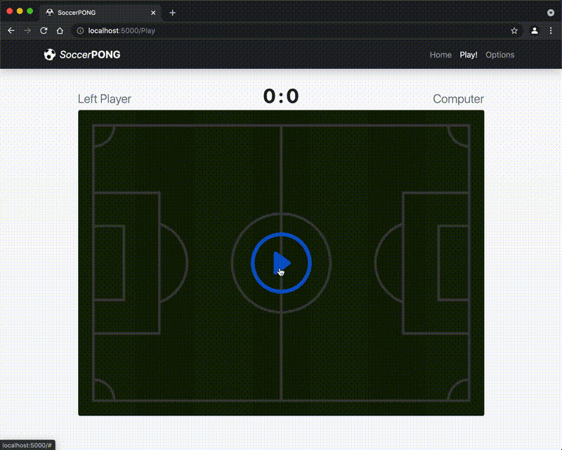

# SoccerPONG

A Pong clone to explore the development process of a Full-stack Web App using ASP.NET Blazor WebAssembly.

## Play Online

> ## https://mdeclerk.github.io/SoccerPong

_To automatically deploy to GitHub Pages using GitHub Actions I followed [this](https://swimburger.net/blog/dotnet/how-to-deploy-aspnet-blazor-webassembly-to-github-pages) awesome tutorial._

## Play Locally

1. Install [Microsoft .NET SDK 5.0](https://dotnet.microsoft.com/download)

2. Clone Project from GitHub

3. Start Host from CLI (in Project Root Folder)

    `$ dotnet run`

4. Play in Browser: http://localhost:5000

## Play from Docker Container w/ NGINX

1. Install [Docker Desktop](https://docs.docker.com/desktop)

2. Clone Project from GitHub

3. Build Image (in Project Root Folder):

   `$ docker build -t soccerpong:latest .`

4. Run Image:

   `$ docker run -it --rm -p 5000:80 soccerpong:latest`

5. Play in Browser: http://localhost:5000

_For further information on containerizing BlazorWASM apps see [here](https://chrissainty.com/containerising-blazor-applications-with-docker-containerising-a-blazor-webassembly-app)._

## Code Layout

- **Views/** contains front-end UI using Blazor components
    - **Views/Components/** contains reusable UI components
    - **Views/Pages/** contains routable pages

- **Services/** contains back-end game related objects implemented as ASP.NET services managed by dependency injection system

- **wwwroot/** contains static web files e.g. css, images, and [bootstrap5](https://getbootstrap.com/) front-end toolkit

## Dependencies

- **[Blazored.LocalStorage](https://www.nuget.org/packages/Blazored.LocalStorage/)** Used to load/save game options to browsers local storage.